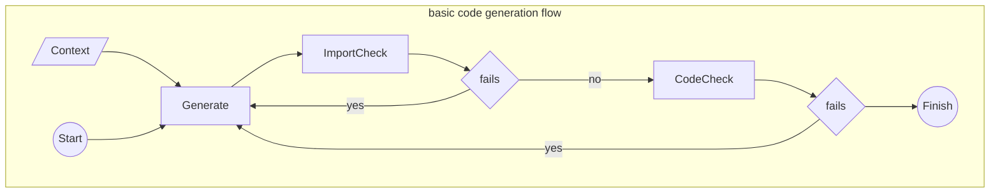

## Overview

This repository contains a basic code generation flow using LangChain and LangGraph that utilises context stuffing instead of RAG. I also practice using LangServe and LangSmith.


### LangChain and LangGraph
1. LangChain's `RecursiveUrlLoader` uses BeautifulSoup to extract context from a
set of webpages.
2. LangGraph's `StateGraph` class is used to define a computational graph that
iterates on the task of creating executable code using the document context,
the user's input and the history of any errors.
3. The flow bails out after three iterations.



By default, the application operates in debug mode. The effect is:
- context is the string "A document"
- uses _gpt-3.5-turbo_ instead of _gpt-4-0125-preview_

### LangSmith
LangSmith is used for observability and traceability:
```bash
$ export LANGCHAIN_TRACING_V2 = true
$ export LANGCHAIN_API_KEY=your_api_key
```
### LangServe
LangServe is used to serve the application and create a basic UI. See `src/app.py` for how this is achieved.

<hr>

### Next Steps
I am happy with the learning that was achieved. However, there are further learning opportunities:

#### Sandbox
Execute the code/imports in a sandbox environment.
- Docker?
- AWS Lambda?
- AWS Fargate?

#### Evaluate
 
Evaluate the LLM application's performance for correctness and speed.
- a test set?
- an evaluator model?
- statistical metrics?

#### Secure
Review security vulnerabilities and harden against attacks.

#### Search
Improve the search/retrieval of context.

#### Prompt
Experiment with different prompting methods.

#### Flow
Experiment with a TDD node.