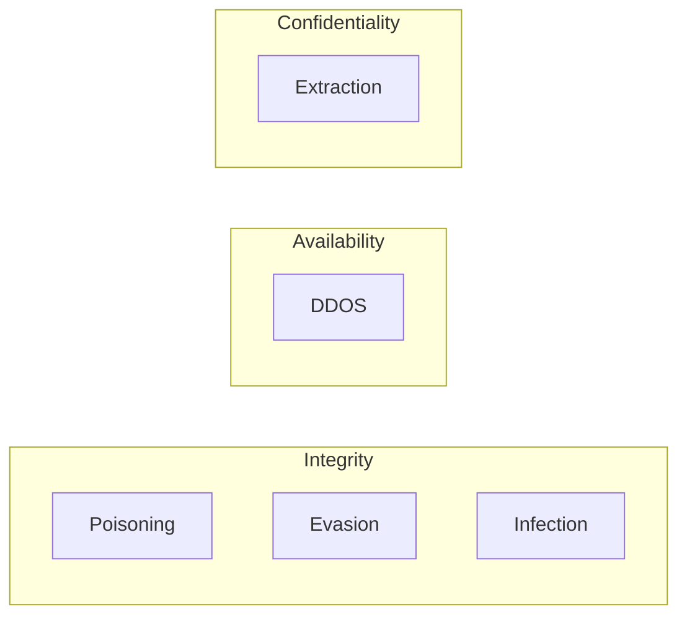

When thinking about security issues for an LLM application, reflect on the CIA security triad: confidentiality, integrity and availability.
As per [Artificial intelligence: the new attack surface](https://www.youtube.com/watch?v=_9x-mAHGgC4), LLM applications require a new focus on defending against integrity attacks.

| Attack | Description|
| ---- | ---- | 
| Poisoning | Control a model with training data modification | 
| Evasion | Change the model behaviour with input modifications |
| Extraction| | Steal a model through queries |
| Inference | Attack the privacy of training data |
